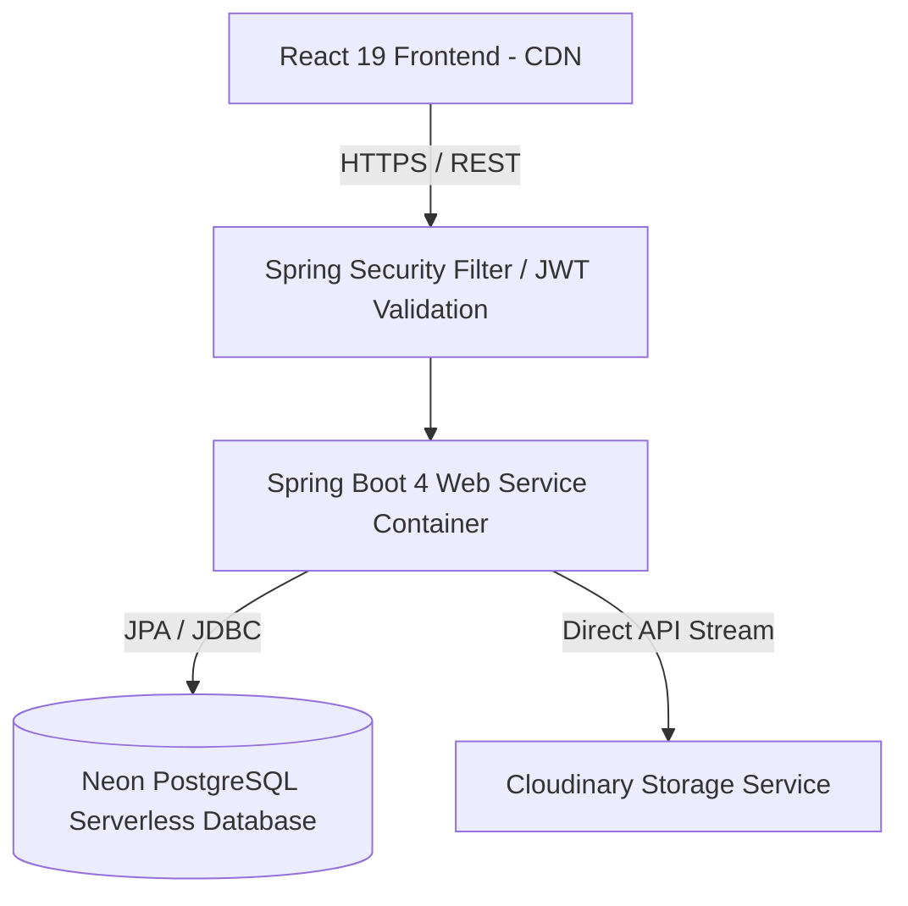

# 🔐 VaultCore — Cloud Asset Management & Sharing Platform

VaultCore is a full-stack, secure cloud asset management platform engineered for seamless file storage, role-based sharing hierarchies, in-memory cloud file processing, and robust user identity management.

---

## 🛠️ System Architecture & Tech Stack

VaultCore is built as a decoupled, multi-tier application designed for high availability and secure data transitions.



### Technology Highlights:
- **Frontend:** React 19, Vite, Lucide Icons, Glassmorphism Design
- **Backend Core:** Spring Boot 4, Java 21, Lombok
- **Security & IAM:** Spring Security, JWT (Stateless Authentication), Custom Method Security Evaluators
- **Database:** Serverless PostgreSQL, H2 (Local Development Environment)
- **Cloud Storage Infrastructure:** Cloudinary SDK (Auto-Mime handling)
- **Containerization:** Docker (Multi-stage build orchestration)

---

## ✨ Features & Engineering Highlights

- 🔑 **Stateless Authentication:** Secure login using cryptographically signed JSON Web Tokens (JWT).
- ☁️ **Cloud Native Storage:** Direct cloud storage integration to minimize local disk writes and ensure 100% data persistence.
- 🗜️ **In-Memory Cloud Processing:** native Java streams perform ZIP compression/extraction entirely in-memory, bypassing local disk IO bottlenecks.
- 🤝 **Granular Sharing Hierarchy:** Standardizes folder sharing with custom Access Control Lists (`OWNER`, `EDITOR`, `READER`).
- 👤 **Customizable Identity Profiles:** Supports personalized photo uploads or selection from 6 cute cartoon animal presets.
- 🌙 **Glassmorphic Responsive UI:** A premium dark-mode interface with a collapsible layout, custom animations, and responsive components.

---

## 🔒 Security & Access Control

VaultCore enforces strict API-level security using Spring Method Security. All asset operations require dynamic evaluation before processing:

```
[User Action Request]
        ↓
[Spring Security JWT Filter Check]
        ↓
[@PreAuthorize Method Interception]
        ↓
[AssetSecurityEvaluator checks ACL Database]
        ↓
[Permitted] → File Access / Edit / Deletion
```

- **Owner:** Full administrative permissions (deletion, metadata update, permission management).
- **Editor:** Can read, edit metadata, and execute compression/extraction workflows.
- **Reader:** Read-only access (can only view or download assets).
- **SQL Protection:** Parameterized queries and Spring Data JPA prevent SQL Injection vulnerabilities.

---

## 📐 SOLID Principles Implementation

VaultCore's backend design adheres strictly to the **SOLID** software design principles, ensuring a modular, testable, and maintainable codebase:

- **S - Single Responsibility Principle (SRP):** Classes are designed with a singular focus. For instance, `CloudinaryStorageService` is only responsible for external cloud operations, `AssetSecurityEvaluator` solely handles access control decisions, and `AssetController` is dedicated strictly to managing HTTP REST mapping and request validation.
- **O - Open/Closed Principle (OCP):** Application security checks are open to extension but closed for modification. By delegating complex ACL checks to custom evaluators under `@PreAuthorize("@assetSecurity.canRead(#id)")`, we can append new access validation rules without altering the core Spring Security filter chain configurations.
- **L - Liskov Substitution Principle (LSP):** Custom user representation (`UserDetailsImpl`) implements the core `UserDetails` interface. It can seamlessly substitute Spring Security's native user details contracts across the framework during authentication and authorization context resolution without breaking core routines.
- **I - Interface Segregation Principle (ISP):** Instead of one bloated service or repository interface, specific, segregated interfaces are utilized. The repository layer segregates data operations (`UserRepository`, `AssetRepository`) using narrow, domain-specific JPA contracts, avoiding exposing unnecessary backend query methods.
- **D - Dependency Inversion Principle (DIP):** Controllers and helper components depend on abstractions rather than concrete classes. This is achieved via Spring's **Dependency Injection** system (`@Autowired`), decoupling controllers from database logic implementations and allowing easy mocking during integration tests.

---

## 🏃 Running Locally

### Prerequisites
- Java 21 or higher
- Node.js 18 or higher
- Maven (packaged wrapper included)

### 1. Backend Setup
Configure your environment keys in `src/main/resources/application.properties` (or set them as environment variables):
```properties
spring.datasource.url=jdbc:h2:file:./data/cmsdb
cloudinary.cloud-name=YOUR_CLOUD_NAME
cloudinary.api-key=YOUR_API_KEY
cloudinary.api-secret=YOUR_API_SECRET
```

Run the Spring Boot application:
```bash
./mvnw spring-boot:run
```
The server will start locally at `http://localhost:8080`.

### 2. Frontend Setup
Install dependencies and run the Vite dev server:
```bash
cd frontend
npm install
npm run dev
```
The application will be live at `http://localhost:5173`.

---

## 📦 Cloud Deployment & Architecture

VaultCore is fully configured for automated cloud deployment:

- **Frontend hosting:** Served as static content via Global CDN networks (e.g. Vercel).
- **Backend hosting:** Run as containerized services (via standard `Dockerfile` configurations) in scalable cloud runners.
- **Data storage:** Managed PostgreSQL database service with SSL encryption.
- **Asset delivery:** Globally distributed CDN for media caching.
